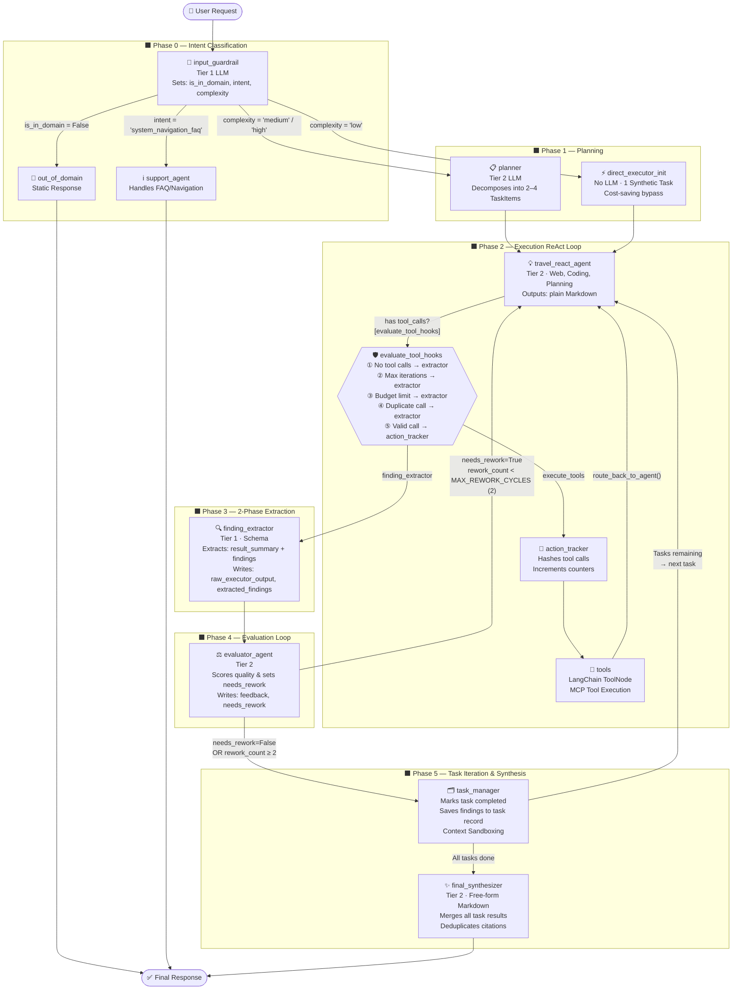

# Agent Cognitive Engine — Graph Architecture V2

> **Đường dẫn thư mục:** `agent/app/graph/`  
> **Framework:** LangGraph (`StateGraph`)  
> **Entry point:** `workflow.py → compiled_graph`  
> **State schema:** `state.py → AgentState`

---

## Mục lục

1. [Tổng quan về Kiến trúc V2 (Upgraded)](#1-tổng-quan-về-kiến-trúc-v2-upgraded)
2. [AgentState — Schema trạng thái](#2-agentstate--schema-trạng-thái)
3. [Bảng đăng ký Node (Node Registry)](#3-bảng-đăng-ký-node-node-registry)
4. [Mô tả chi tiết từng Node](#4-mô-tả-chi-tiết-từng-node)
5. [Workflow & Các luồng định tuyến chi tiết](#5-workflow--các-luồng-định-tuyến-chi-tiết)
6. [Cơ chế tối ưu hóa nâng cao trong V2](#6-cơ-chế-tối-ưu-hóa-nâng-cao-trong-v2)
7. [Safeguards & Giới hạn cứng (Hard Limits)](#7-safeguards--giới-hạn-cứng-hard-limits)
8. [Chiến lược LLM Tiers & Caching](#8-chiến-lược-llm-tiers--caching)

---

## 1. Tổng quan về Kiến trúc V2 (Upgraded)

Kiến trúc **Cognitive Graph V2** được nâng cấp toàn diện thông qua quá trình tái cấu trúc (refactoring) để giải quyết các hạn chế liên quan đến lỗi JSON parsing, vòng lặp phản hồi vô tận, và chi phí LLM.

Các quyết định kiến trúc cốt lõi bao gồm:
1. **2-Phase Content/Extraction Separation:** Các node Executor trả về Markdown tự do. Một node `finding_extractor` chuyên biệt sẽ phân tích và trích xuất cấu trúc dữ liệu JSON (Pydantic schema) ở giai đoạn sau, loại bỏ hoàn toàn lỗi `JSONDecodeError`.
2. **Complexity-Aware Routing:** Phân loại độ phức tạp tại cửa ngõ. Các yêu cầu đơn giản bỏ qua hoàn toàn Planner (tiết kiệm chi phí). Các yêu cầu phức tạp được phân rã thành hàng đợi các task.
3. **Programmatic Safeguards:** Mọi nguy cơ lặp vô tận đều được ngăn chặn bằng các hằng số cấu hình cứng, được thực thi bên ngoài LLM prompts (trong các hàm conditional edges).
4. **Context Sandboxing:** Xóa bỏ các message trung gian của các task trước khi chuyển sang task mới. Các phát hiện quan trọng được chắt lọc thành `findings` và truyền sang task tiếp theo qua system prompt để chống tràn context.

---

## 2. AgentState — Schema trạng thái

Toàn bộ dữ liệu truyền giữa các node được quản lý thông qua `AgentState` (`TypedDict`).

```
AgentState
├── messages            → Chuỗi hội thoại chính (add_messages reducer)
├── user_id             → ID định danh người dùng
├── session_id          → ID phiên làm việc (session)
│
├── ── PHASE 1: GUARDRAIL & INTENT CLASSIFICATION ──────────────
├── is_in_domain        → True nếu là yêu cầu du lịch (booking/faq), False nếu ngoài lề
├── intent_category     → Phân loại ý định ("hotel_booking" | "flight_booking" | "system_navigation_faq" | "itinerary_planning")
├── complexity          → Mức độ phức tạp ("low" | "medium" | "high")
├── objective           → Mục tiêu tổng quát chung
├── detected_language   → Ngôn ngữ được phát hiện của user prompt
│
├── ── PHASE 2: WORKFLOW MEMORY (PROCEDURAL STATE) ──────────────
├── tasks               → Danh sách tasks có cấu trúc (dict)
├── current_task_id     → ID của sub-task đang thực thi
│
├── ── PHASE 3: LOOP MANAGEMENT & SAFEGUARDS ────────────────────
├── iteration_count     → Số vòng ReAct đã thực hiện của task hiện tại (max 8)
├── tool_call_count     → Tổng số tool đã gọi xuyên suốt graph (max 10)
├── action_history      → Danh sách MD5 hash của các tool calls để tránh gọi trùng
├── rework_count        → Số lần rework từ Evaluator -> Executor (max 2)
│
└── ── EVALUATION MEMORY ─────────────────────────────────────────
    ├── evaluator_feedback  → Phản hồi chi tiết từ Evaluator
    ├── needs_rework        → Boolean chỉ định có cần executor làm lại không
    ├── raw_executor_output → Văn bản Markdown gốc từ Executor (đã qua extractor)
    ├── extracted_findings  → Tập hợp các phát hiện quan trọng dạng JSON
    └── final_answer        → (Dành riêng) Câu trả lời tổng hợp cuối cùng
```

---

## 3. Bảng đăng ký Node (Node Registry)

| # | Tên Node | Chức năng chính | LLM Tier | Loại Node |
|---|---|---|---|---|
| 0 | `input_guardrail` | Phân loại ý định, từ chối câu hỏi ngoài lề, đánh giá độ phức tạp. | Tier 1 (Fast) | Async Node |
| 1 | `out_of_domain` | Trả lời tĩnh cho các câu hỏi không thuộc chuyên môn du lịch. | *(Không dùng LLM)* | Async Node |
| 2 | `support_agent` | Xử lý FAQ và điều hướng hệ thống cơ bản mà không cần vào luồng sâu. | Tier 2 (Balanced) | Async Node |
| 3 | `planner` | Phân rã mục tiêu phức tạp thành chuỗi 2-4 sub-tasks. | Tier 2 (Balanced) | Async Node |
| 4 | `direct_executor_init` | Khởi tạo trạng thái cho luồng bypass khi complexity='low'. | *(Không dùng LLM)* | Async Node |
| 5 | `travel_react_agent` | Executor ReAct chung xử lý lập luận, gọi tools và xuất Markdown. | Tier 2 (Balanced) | Async Node |
| 6 | `action_tracker` | Interceptor ghi nhận hash và đếm tool calls trước khi thực thi. | *(Không dùng LLM)* | Async Node |
| 7 | `tools` | Thực thi MCP tool calls (LangChain ToolNode). | *(External)* | ToolNode |
| 8 | `finding_extractor` | Đọc Markdown của Executor và trích xuất ra JSON schema nghiêm ngặt. | Tier 1 (Fast) | Async Node |
| 9 | `evaluator_agent` | Gộp chung đánh giá chất lượng (Critic) và Quyết định làm lại (Reflection). | Tier 2 (Balanced) | Async Node |
| 10 | `task_manager` | Lưu kết quả, chuyển tiếp task, thực hiện Context Sandboxing. | *(Không dùng LLM)* | Async Node |
| 11 | `final_synthesizer` | Tổng hợp toàn bộ findings & kết quả thô của các task thành báo cáo hoàn chỉnh. | Tier 2 (Balanced) | Async Node |

---

## 4. Mô tả chi tiết từng Node

### 4.1. Node `input_guardrail`
*   **Vị trí:** Điểm bắt đầu (Entry Point) của đồ thị.
*   **Đặc điểm:** Sử dụng Tier 1 LLM.
*   **Nhiệm vụ:** Phân loại độ phức tạp (`complexity`), kiểm tra tính hợp lệ (`is_in_domain`), và xác định ý định (`intent_category`).
*   **Điều hướng:** Các câu hỏi ngoài lề đi tới `out_of_domain`, câu hỏi hệ thống tới `support_agent`. Các tác vụ dễ tới `direct_executor_init`, còn lại tới `planner`.

### 4.2. Node `planner`
*   **Nhiệm vụ:** Hoạt động như Project Manager, phân rã mục tiêu thành 2-4 tác vụ nối tiếp (TaskItems). Luôn truyền thẳng các tác vụ tới `travel_react_agent`.

### 4.3. Node `direct_executor_init`
*   **Nhiệm vụ:** Bỏ qua `planner` với các task có độ phức tạp thấp. Tạo 1 synthetic task duy nhất bọc lại prompt của user, thiết lập các biến vòng lặp, và đi thẳng vào `travel_react_agent`.

### 4.4. Node `travel_react_agent` (Executor)
*   **Nhiệm vụ:** Vòng lặp **Reason-and-Act (ReAct)** chính yếu.
*   **Đầu ra:** Xuất ra kết quả dạng **plain Markdown tự do**, KHÔNG yêu cầu LLM phải format JSON tại bước này để tránh lỗi schema parsing khi trả về các code snippets hay bảng biểu.
*   Sử dụng Hybrid Search RAG và hệ thống MCP Tools.

### 4.5. Node `action_tracker` & `tools`
*   **`action_tracker`:** Hashing tool call param (MD5) để so sánh trong history, tăng biến đếm ngân sách tool (tool budget tracker).
*   **`tools`:** LangChain `ToolNode` thực thi MCP servers. Trả kết quả ngược lại cho `travel_react_agent`.

### 4.6. Node `finding_extractor`
*   **Vị trí:** Ngay sau khi Executor hoàn thành suy luận (không gọi tool nữa).
*   **Đặc điểm:** Sử dụng cấu trúc đầu ra nghiêm ngặt (Structured Output) với Tier 1 LLM (nhanh, chi phí thấp).
*   **Nhiệm vụ:** Bóc tách kết quả văn bản tự do của Executor thành 2 phần: `raw_executor_output` (tóm tắt kết quả) và `extracted_findings` (mảng các phát hiện quan trọng có cấu trúc rõ ràng). Đây là trái tim của cơ chế **2-Phase Extraction**.

### 4.7. Node `evaluator_agent`
*   **Nhiệm vụ:** Là sự kết hợp của Critic và Reflection agent cũ.
*   Chấm điểm chất lượng (sử dụng công cụ, trích nguồn, độ chính xác, độ mới) và ngay lập tức đưa ra quyết định `needs_rework` (True/False) cùng nhận xét sửa đổi.
*   Kiểm tra `rework_count` để điều hướng về lại Executor hoặc đi tiếp sang `task_manager`.

### 4.8. Node `task_manager`
*   **Nhiệm vụ:** Trình quản lý tác vụ (không tốn LLM).
*   Lưu `raw_executor_output` và `extracted_findings` vào bộ nhớ của tác vụ hiện hành.
*   Thực hiện **Context Sandboxing**: Xóa lịch sử hội thoại trung gian của tác vụ vừa xong, bơm các findings vào làm system context cho tác vụ kế tiếp.

### 4.9. Node `final_synthesizer`
*   **Nhiệm vụ:** Đọc lại tất cả các tasks đã hoàn thành. Kết hợp văn bản thô và trích xuất để sinh ra một Markdown report thống nhất, có phần tổng quan và danh mục trích nguồn mạch lạc.

---

## 5. Workflow & Các luồng định tuyến chi tiết

### 5.1. Sơ đồ luồng tổng quan (Workflow Diagram)



### 5.2. Bản đồ các nhánh rẽ điều kiện (Conditional Edges Map)

1.  **Sau `input_guardrail` (`route_from_guardrail`):**
    *   `is_in_domain = False` $\rightarrow$ `out_of_domain`.
    *   `intent_category == 'system_navigation_faq'` $\rightarrow$ `support_agent`.
    *   `complexity == 'low'` $\rightarrow$ `direct_executor_init`.
    *   Mặc định / Khác $\rightarrow$ `planner`.
2.  **Sau `travel_react_agent` (`evaluate_tool_hooks`):**
    *   Nếu có tool call hợp lệ $\rightarrow$ đi tới `action_tracker`.
    *   Nếu gặp lỗi lặp vô tận, trùng tool, hay cạn ngân sách $\rightarrow$ ép luồng chạy tới `finding_extractor`.
    *   Nếu Executor hoàn thành không gọi tool $\rightarrow$ đi tới `finding_extractor`.
3.  **Sau `evaluator_agent` (`route_from_evaluator`):**
    *   `needs_rework = True` VÀ `rework_count < 2` $\rightarrow$ đi tới `travel_react_agent` (Rework).
    *   `needs_rework = False` HOẶC `rework_count >= 2` $\rightarrow$ đi tới `task_manager`.
4.  **Sau `task_manager` (`route_from_task_manager`):**
    *   Nếu `current_task_id` hợp lệ (còn task) $\rightarrow$ quay lại `travel_react_agent` với task mới.
    *   Nếu hết task $\rightarrow$ đi tới `final_synthesizer`.

---

## 6. Cơ chế tối ưu hóa nâng cao trong V2

### 6.1. Context Sandboxing (Cô lập ngữ cảnh tuyệt đối)

Khi một tác vụ ReAct chạy, nó sinh ra rất nhiều lượt Thought, Action và Tool Observation (lên tới hàng chục nghìn tokens). Nếu giữ nguyên lịch sử này sang Task 2, LLM sẽ bị quá tải context, gây nhiễu và giảm chất lượng lập luận.

**Cách hoạt động của Sandboxing:**
1. Khi `task_manager` phát hiện hoàn thành một tác vụ và chuyển sang tác vụ mới, nó tạo ra các `RemoveMessage` để dọn dẹp các tin nhắn rác sinh ra trong Task 1.
2. Nó chuyển `extracted_findings` của Task 1 vào prompt ngữ cảnh cho Task 2. Nhờ đó, Executor xử lý Task 2 chỉ nhận được một lượng thông tin chắt lọc nhất định mà không cần đọc lại toàn bộ Tool Logs của Task 1.

### 6.2. 2-Phase Information Extraction

Việc ép LLM phải suy luận logic (ReAct), quyết định gọi tool, đồng thời xuất ra chuỗi JSON định dạng khắt khe là nguyên nhân chính gây lỗi `JSONDecodeError` trong các Graph trước đây. V2 xử lý triệt để việc này bằng:
- **Phase 1 (Creation):** `travel_react_agent` cứ tự do suy nghĩ và giao tiếp bằng văn bản (như ChatGPT thông thường).
- **Phase 2 (Extraction):** Khi Phase 1 hoàn tất, `finding_extractor` (sử dụng model nhanh/rẻ tier 1) đứng ra đọc đoạn văn bản tự do đó và bóc tách thành đối tượng Python có cấu trúc.

Điều này làm cho hệ thống vô cùng bền bỉ (resilient) trước mọi đầu ra kỳ lạ của LLM, đặc biệt là khi LLM sinh ra markdown bảng biểu hoặc code blocks.

---

## 7. Safeguards & Giới hạn cứng (Hard Limits)

Để đảm bảo hệ thống không bị lặp vô tận (looping) hoặc tiêu tốn quá nhiều chi phí API khi gặp các câu hỏi hóc búa, đồ thị tích hợp 4 chốt chặn an toàn tại node điều hướng `evaluate_tool_hooks` và `route_from_evaluator`:

| Giới hạn | Tên hằng số | Mục đích | Cách xử lý khi kích hoạt |
|---|---|---|---|
| **Max Iterations** | `MAX_ITERATIONS = 8` | Giới hạn tối đa số lượt Thought-Action trong một task. | Ngắt ReAct loop, chuyển tiếp tới `finding_extractor`. |
| **Max Tool Calls** | `MAX_TOOL_CALLS = 10` | Giới hạn tổng số lần gọi tool trong cả vòng đời của session. | Ngắt ReAct loop, chuyển tiếp tới `finding_extractor`. |
| **Duplicate Tool Detection** | MD5 hash list | Ngăn chặn việc LLM liên tục gọi một tool với các tham số giống hệt nhau khi bị bí. | Block tool call hiện tại, chuyển tới `finding_extractor`. |
| **Max Rework Cycles** | `MAX_REWORK_CYCLES = 2` | Tránh việc Evaluator bắt làm lại quá nhiều lần đối với một task khó. | Cưỡng chế chuyển sang `task_manager` để hoàn thành task hiện tại và đi tiếp. |

---

## 8. Chiến lược LLM Tiers & Caching (Dynamic Provider Support)

Nhằm tối ưu hóa giữa hiệu năng (quality), chi phí (cost) và độ trễ (latency), hệ thống phân loại mô hình LLM theo 3 tầng chiến lược. Đồng thời, phiên bản V2 hỗ trợ **định cấu hình động (Dynamic Configuration)** cho phép người dùng lựa chọn provider (OpenAI hoặc Gemini) và nạp khóa API riêng cho từng phiên yêu cầu.

```
                     ┌───────────────────────────────┐
                     │           USER PROMPT         │
                     └───────────────┬───────────────┘
                                     │
                 ┌───────────────────┼───────────────────┐
                 ▼                   ▼                   ▼
            [TIER 1 - Fast]     [TIER 2 - Balanced]  [TIER 3 - Reasoning]
             gpt-4o-mini /       gpt-4o /            o1-mini /
             gemini-1.5-flash    gemini-1.5-flash    gemini-1.5-pro
                 │                   │                   │
            Phân loại ý định     General Executor       Deep Research
            Trích xuất Finding   Planner & Evaluator    Toán học phức tạp
            Vision Detection     Synthesizer            Học máy chuyên sâu
```

### 8.1. Dynamic LLM Factory (`get_llm_instance`)
Thay vì khởi tạo cố định ở cấp độ module, hệ thống sử dụng một nhà máy khởi tạo động `get_llm_instance(tier, config)` để phân giải cấu hình tại thời điểm chạy (runtime):
1.  **Phân giải Provider:** Đọc từ trường `llm_provider` trong `configurable`. Nếu trống, kiểm tra sự tồn tại của `GEMINI_API_KEY` để chọn mặc định `gemini`, ngược lại sử dụng `openai`.
2.  **Đọc khóa API & Base URL:** Cho phép ghi đè API Key và Endpoint từ request. Nếu không có, hệ thống tự động tìm và sử dụng biến môi trường mặc định tương ứng.
3.  **Áp dụng Tầng Mô hình (Tier Model Mapping):**
    *   **OpenAI:** Tier 1 $\rightarrow$ `gpt-4o-mini`, Tier 2 $\rightarrow$ `gpt-4o`, Tier 3 $\rightarrow$ `o1-mini` (hoặc cấu hình tương đương).
    *   **Gemini:** Tier 1 $\rightarrow$ `gemini-1.5-flash`, Tier 2 $\rightarrow$ `gemini-1.5-flash`, Tier 3 $\rightarrow$ `gemini-1.5-pro` (sử dụng thư viện `langchain-google-genai` hoặc OpenAI compatibility endpoint).

### 8.2. Phương thức kích hoạt Dynamic từ Client

#### A. Qua HTTP API (REST Endpoint)
Gửi yêu cầu tới `/chat/stream` kèm theo các trường tùy chọn trong JSON body:
```json
{
  "user_id": "user_123",
  "session_id": "session_abc",
  "prompt": "Analyze this research paper...",
  "llm_provider": "gemini",
  "api_key": "AIzaSy...",
  "tier3_model": "gemini-1.5-pro"
}
```

#### B. Qua gRPC API (Metadata/Headers)
Do protobuf schema được giữ nguyên để đảm bảo khả năng tương thích ngược (C# / .NET Client), các tham số cấu hình động được truyền qua **gRPC Metadata (Headers)** với tiền tố `x-`:
*   `x-llm-provider` (ví dụ: `gemini` hoặc `openai`)
*   `x-api-key` (ví dụ: `AIzaSy...` hoặc `sk-...`)
*   `x-base-url` (endpoint API tùy chỉnh)
*   `x-tier1-model`, `x-tier2-model`, `x-tier3-model` (tên model ghi đè)

### 8.3. Cấu trúc Caching Tối ưu hóa Hiệu năng
Để tránh việc khởi tạo lại mô hình và biên dịch schema gây tăng độ trễ (cold start latency), 3 cơ chế cache song song được áp dụng:

1.  **Cache thực thể LLM (`_LLM_INSTANCE_CACHE`):** Cache các đối tượng mô hình dựa trên hash của API key, tên model, base URL và cấu hình max tokens.
2.  **Cache cấu trúc đầu ra (`_STRUCTURED_LLM_CACHE`):** Lưu trữ kết quả biên dịch của `.with_structured_output(schema)` trên từng thực thể model để tránh dịch JSON Schema lặp đi lặp lại.
3.  **Cache Bind Tool (`_BOUND_LLM_CACHE`):** Cache các thực thể mô hình đã liên kết với các công cụ MCP chuyên biệt của từng domain trong thời gian **O(1)**.
