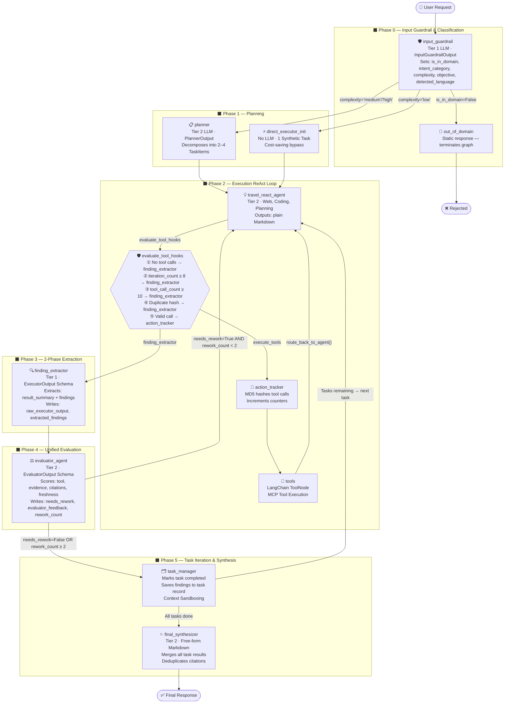

# Cognitive Agent Engine — Travel Booking Assistant

> **Version:** Post-Refactor (Unified Evaluator Pipeline)
> **Providers:** OpenAI · Anthropic (Claude)
> **Orchestration:** LangGraph `StateGraph`
> **Serving:** FastAPI (REST/SSE) · gRPC Streaming · MCP (Stdio)

---

## 1. Core Design Principles

The system operates as a **directed acyclic graph** (with intentional cycles for tool loops and rework loops). Four key architectural decisions shape the entire design:

1. **Input Guardrail First** — Every request is classified for domain relevance and intent category (`hotel_booking`, `flight_booking`, `itinerary_planning`, `travel_faq`) before any executor runs. Out-of-domain requests are short-circuited immediately.
2. **2-Phase Content/Extraction Separation** — Executor nodes output free-form Markdown. A dedicated `finding_extractor` node applies a structured LLM call downstream to safely parse findings into typed Pydantic schemas.
3. **Complexity-Aware Routing** — Simple requests bypass the Planner entirely (cost savings). Complex, multi-step requests are decomposed into a sequential task queue.
4. **Programmatic Safeguards** — Every potential infinite loop in the graph is bounded by hard constants enforced in the conditional edge functions (`evaluate_tool_hooks`, `route_from_evaluator`), not in LLM prompts.

---

## 2. AgentState — Shared Memory

All nodes communicate exclusively through `AgentState`, a `TypedDict` that LangGraph hydrates and persists across the graph.

| Field | Type | Set By | Read By |
|---|---|---|---|
| `messages` | `Annotated[Sequence[BaseMessage], add_messages]` | All nodes | All nodes |
| `user_id` / `session_id` | `Optional[str]` | API entry | Executor nodes |
| `is_in_domain` | `Optional[bool]` | `input_guardrail` | `route_from_guardrail` |
| `intent_category` | `Optional[str]` | `input_guardrail` | `travel_react_agent` |
| `complexity` | `Optional[str]` | `input_guardrail` | `route_from_guardrail` |
| `objective` | `Optional[str]` | `input_guardrail` | `planner`, `evaluator_agent` |
| `detected_language` | `Optional[str]` | `input_guardrail` | `final_synthesizer` |
| `tasks` | `List[Dict[str, Any]]` | `planner` / `direct_executor_init` | `task_manager`, Executors |
| `current_task_id` | `Optional[int]` | `planner` / `task_manager` | `task_manager`, Executors |
| `iteration_count` | `int` | `planner` → Executors | `evaluate_tool_hooks` |
| `tool_call_count` | `int` | `action_tracker` | `evaluate_tool_hooks` |
| `action_history` | `List[str]` | `action_tracker` | `evaluate_tool_hooks` |
| `rework_count` | `int` | `evaluator_agent` | `route_from_evaluator` |
| `evaluator_feedback` | `Optional[str]` | `evaluator_agent` | (logging) |
| `evaluator_notes` | `Optional[str]` | `evaluator_agent` | (logging) |
| `needs_rework` | `Optional[bool]` | `evaluator_agent` | `route_from_evaluator` |
| `raw_executor_output` | `Optional[str]` | `finding_extractor` | `evaluator_agent`, `task_manager` |
| `extracted_findings` | `List[Dict[str, Any]]` | `finding_extractor` | `evaluator_agent`, `task_manager` |
| `cache_hit` | `Optional[bool]` | Semantic cache layer | (metrics) |

---

## 3. Node Reference

### Phase 0 — Input Guardrail & Intent Classification

#### `input_guardrail`
- **LLM Tier:** Tier 1 (fast)
- **Output Schema:** `InputGuardrailOutput` (Pydantic, structured output)
- **Writes to State:** `is_in_domain`, `intent_category`, `complexity`, `objective`, `detected_language`
- **Description:** The graph entry point. Reads the latest user message and classifies intent category, complexity tier, and language. Out-of-domain requests set `is_in_domain=False` and are immediately routed to `out_of_domain`. Uses the `workflow.md` manifest for baseline operational instructions.

#### `out_of_domain` *(inline node)*
- **LLM Tier:** None (static response)
- **Activated When:** `is_in_domain == False`
- **Description:** Returns a fixed polite refusal message and terminates the graph.

---

### Phase 1 — Planning

#### `planner`
- **LLM Tier:** Tier 2 (balanced)
- **Output Schema:** `PlannerOutput` → `List[TaskItem]` (Pydantic)
- **Activated When:** `complexity` is `'medium'` or `'high'`
- **Writes to State:** `tasks`, `current_task_id`, `iteration_count` = 0, `tool_call_count` = 0, `action_history` = [], `rework_count` = 0
- **Description:** Acts as a project manager. Decomposes the user's objective into 2–4 sequential `TaskItem` sub-tasks. Falls back to a single-task plan if the structured LLM call fails.

#### `direct_executor_init`
- **LLM Tier:** None (pure logic node)
- **Activated When:** `complexity` is `'low'`
- **Writes to State:** `tasks` (1 synthetic task from `objective`), `current_task_id` = 1, all counters reset
- **Description:** A cost-saving bypass. Skips the Planner entirely and wraps the `objective` into a single task object, then routes directly to the executor.

---

### Phase 2 — Execution (ReAct Loop)

The executor node follows the **Reason → Action → Observation → Evaluate** cycle and produces **free-form Markdown output**. JSON formatting is never requested from the executor — that responsibility belongs entirely to `finding_extractor`.

#### `travel_react_agent`
- **LLM Tier:** Tier 2 (balanced)
- **Domain:** General-purpose travel — web searches, hotel/flight lookups, itinerary planning, travel FAQs
- **Tools:** Full MCP tool suite bound via `get_cached_bound_llm("travel", base_llm)`
- **Context:** Injects `workflow.md` manifest + intent-specific directives + task context from `_build_task_context()`
- **Token Management:** Context window pruned by `prune_messages_by_token_limit()` using `provider_cfg.max_context_tokens`
- **Intent-aware Directives:**
  - `hotel_booking` → focus on dates, pricing, location
  - `flight_booking` → verify origin, destination, dates, passenger counts
  - `itinerary_planning` → logical progression, travel times, distances
  - `travel_faq` → rely on knowledge base

---

### Phase 2 — Tool Execution Infrastructure

#### `action_tracker`
- **LLM Tier:** None (pure logic node)
- **Description:** An interceptor that sits **before** the actual tool node. Hashes each `(tool_name, args)` pair via MD5 and appends to `action_history`. Increments `tool_call_count`. This enables duplicate detection and budget enforcement in `evaluate_tool_hooks`.

#### `tools` *(LangChain ToolNode)*
- **Description:** Standard LangChain `ToolNode` wrapping all MCP tools loaded by `DynamicMcpClientManager`. Executes the tool call and appends a `ToolMessage` to the message stream. Always routes back to `travel_react_agent` via `route_back_to_agent`.

---

### Phase 3 — 2-Phase Information Extraction

#### `finding_extractor`
- **LLM Tier:** Tier 1 (fast)
- **Output Schema:** `ExecutorOutput` → `result_summary` + `List[Finding]` (Pydantic)
- **Writes to State:** `raw_executor_output`, `extracted_findings`
- **Description:** Receives the executor's raw Markdown output, then applies a short, tightly-scoped structured-output call to extract structured findings. **This is the only place where JSON is produced from executor content.** Isolating extraction here (with a focused prompt + Function Calling) eliminates `JSONDecodeError` failures that occurred when executors generated code snippets or Markdown headers embedded in JSON fields.

---

### Phase 4 — Unified Evaluation (Critic + Reflection merged)

#### `evaluator_agent`
- **LLM Tier:** Tier 2 (balanced)
- **Output Schema:** `EvaluatorOutput` (Pydantic) — combines what was previously `CriticOutput` + `ReflectionOutput`
- **Reads from State:** `raw_executor_output`, `extracted_findings`, `objective`, `action_history`, `rework_count`
- **Writes to State:** `evaluator_feedback`, `evaluator_notes`, `needs_rework`, `rework_count`
- **Description:** Single consolidated evaluator replacing the previous `critic_agent` + `reflection_agent` pair. Audits execution against the master objective using 4 scored dimensions (`tool_quality_score`, `evidence_quality_score`, `citation_quality_score`, `freshness_score`, each 1–10). Simultaneously determines `needs_rework` (boolean) and generates `actionable_advice`. Falls back gracefully if the structured parse fails.

---

### Phase 5 — Task Iteration & Final Output

#### `task_manager`
- **LLM Tier:** None (pure logic node)
- **Reads from State:** `raw_executor_output`, `extracted_findings`, `tasks`, `current_task_id`
- **Writes to State:** `tasks` (marks current as `completed`), advances `current_task_id`
- **Description:** The iteration controller. Reads `raw_executor_output` and `extracted_findings` directly from state (set by `finding_extractor`) — zero JSON parsing. When more tasks remain, performs **Context Sandboxing**: removes all AI/tool messages after the last `HumanMessage` to reset the context window for the next task, then queues the next `current_task_id`. When all tasks are done, sets `current_task_id = None` and routes to `final_synthesizer`.

#### `final_synthesizer`
- **LLM Tier:** Tier 2 (balanced)
- **Writes to State:** `messages` (final AI response)
- **Description:** Reads all completed task results (`task["result"]`) and findings (`task["findings"]`) from the task list, then generates a single, polished, deduplicated Markdown response. Enforces the user's `detected_language`. Strips spurious ` ```markdown ` wrappers as a failsafe. Records `iteration_count` as a Prometheus histogram metric.

---

## 4. Full Graph Diagram



---

## 5. Conditional Edge Router Reference

| Router Function | Source Node | Condition | Target |
|---|---|---|---|
| `route_from_guardrail` | `input_guardrail` | `is_in_domain == False` | `out_of_domain` |
| | | `complexity == 'low'` | `direct_executor_init` |
| | | `complexity != 'low'` | `planner` |
| `evaluate_tool_hooks` | `travel_react_agent` | No tool calls | `finding_extractor` |
| | | `iteration_count >= 8` | `finding_extractor` (forced) |
| | | `tool_call_count >= 10` | `finding_extractor` (forced) |
| | | Duplicate MD5 hash detected | `finding_extractor` (forced) |
| | | Valid tool call | `action_tracker` |
| `route_back_to_agent` | `tools` | Always | `travel_react_agent` |
| `route_from_evaluator` | `evaluator_agent` | `needs_rework=True` AND `rework_count < 2` | `travel_react_agent` |
| | | `needs_rework=False` OR `rework_count >= 2` | `task_manager` |
| `route_from_task_manager` | `task_manager` | `current_task_id is not None` | `travel_react_agent` |
| | | `current_task_id is None` | `final_synthesizer` |

---

## 6. Programmatic Safeguards

All safeguards are enforced in `evaluate_tool_hooks` and `route_from_evaluator` — outside of LLM prompts, making them deterministic and reliable.

| Safeguard | Constant | Enforced In | Action |
|---|---|---|---|
| Max Iterations | `MAX_ITERATIONS = 8` | `evaluate_tool_hooks` | Force-route to `finding_extractor` |
| Max Tool Calls (Budget) | `MAX_TOOL_CALLS = 10` | `evaluate_tool_hooks` | Force-route to `finding_extractor` |
| Duplicate Tool Detection | MD5 hash comparison | `evaluate_tool_hooks` | Block + force-route to `finding_extractor` |
| Max Rework Cycles | `MAX_REWORK_CYCLES = 2` | `route_from_evaluator` | Skip rework, force-advance to `task_manager` |

---

## 7. LLM Tier Assignment

| Tier | Nodes | Purpose |
|---|---|---|
| **Tier 1 (Fast)** | `input_guardrail`, `finding_extractor` | Classification & extraction — short, focused prompts |
| **Tier 2 (Balanced)** | `planner`, `travel_react_agent`, `evaluator_agent`, `final_synthesizer` | Complex reasoning, tool use, synthesis |

> Tier assignments are resolved from `settings.py` via `get_llm_instance(tier, config)` — never hardcoded in node logic. Supported providers: **OpenAI** (`ChatOpenAI`) and **Anthropic** (`ChatAnthropic`). Provider is resolved from `config["configurable"]["llm_provider"]`, falling back to whichever API key is present in `.env`.

### LLM Caching Strategy

Three in-process caches are maintained in `app/graph/config.py`:

| Cache | Key Structure | Purpose |
|---|---|---|
| `_LLM_INSTANCE_CACHE` | `provider_model_apihash_settingsfp` | Base LLM instances |
| `_STRUCTURED_LLM_CACHE` | `base_key + schema_name` | Structured output runnables |
| `_BOUND_LLM_CACHE` | `domain_model_apihash_settingsfp` | Tool-bound LLM runnables |

A `settings_fingerprint` (SHA-256 of all critical config values, truncated to 12 chars) is embedded in every cache key. Any `.env` change (model name, API key) automatically invalidates stale entries with zero TTL management.

### Concurrency & Rate Limiting

```python
# app/core/concurrency.py
TIER2_SEMAPHORE = asyncio.Semaphore(2)   # GitHub Models High tier: 2 concurrent
TIER1_SEMAPHORE = asyncio.Semaphore(4)   # Fast models: 4 concurrent
```

`invoke_llm_with_limit()` wraps every LLM call with both the semaphore and Tenacity retry logic (`stop_after_attempt(4)`, `wait_exponential(multiplier=2, min=5, max=60)`) for 429 rate-limit handling.

---

## 8. MCP Tool Infrastructure

Tools are loaded from external MCP servers via Stdio transport using `DynamicMcpClientManager`.

```
mcp_client.py
├── DynamicMcpClientManager
│   ├── initialize_all_servers()     → Reads mcp_servers_config.json, spawns subprocesses
│   ├── JWT injection                → Signs MCP_CLIENT_TOKEN (5-min validity) for server auth
│   ├── load_mcp_tools(session)      → Converts MCP tools to LangChain Tool format
│   └── shutdown()                   → Closes all Stdio streams
└── get_mcp_tools()                  → Returns cached tool list

tool_registry.py
└── get_tools_by_domain(domain)      → Returns O(1) domain-filtered tool subset

app/mcp/domains/
├── web_tools.py                     → search_web_logic() via Tavily API
│   ├── Query transformation         → transform_user_query() (Tier 1 LLM)
│   ├── Parallel snippet compression → _compress_snippet() (async gather)
│   └── Token budget enforcement     → MAX_TOOL_TOKEN_BUDGET from settings
└── core_tools.py                    → Core travel domain tools
```

**Web Search Pipeline** (`search_web_logic`):
1. Query is optimized via `transform_user_query()` (Tier 1 LLM)
2. Tavily search (`search_depth="advanced"`, `max_results=5`)
3. Snippets > 100 chars are compressed in parallel via `asyncio.gather`
4. Results are token-budgeted using `tiktoken` against `settings.tavily.max_token_budget`

---

## 9. Infrastructure Components (Container)

The `Container` class in `app/bootstrap/container.py` bootstraps all shared infrastructure services on first request via `await container.initialize()`.

```
Container
├── redis_client          → AsyncRedis (session management, :6379)
├── embedding_provider    → OpenAIEmbeddings (text-embedding-3-small) [always OpenAI]
├── vector_store          → QdrantVectorStore (:6333)
├── memory_store          → QdrantMemoryStore (long-term memory writes)
├── semantic_cache        → QdrantSemanticCache (versioned by tier2_balanced_model name)
├── memory_service        → MemoryService (CRUD over memory_store)
├── extractor             → FactExtractor (background fact mining, Tier 1 LLM)
├── memory_worker         → MemoryWorker (RabbitMQ consumer pipeline, :5672)
└── hybrid_search         → HybridRetriever (BM25 + dense vector retrieval)
```

> **Embedding Note:** Embeddings always use OpenAI (`text-embedding-3-small`) regardless of the active LLM provider, because vector spaces must remain fixed per deployment.

> **Semantic Cache Versioning:** The active `tier2_balanced_model` name is embedded as a `model_version` tag in every cached entry. Upgrading the model in `.env` automatically bypasses all stale cache entries — zero manual invalidation required.

---

## 10. Serving Layer

### REST / SSE — FastAPI (`app/main.py`)
- **Port:** `8000`
- **Routes:** `app/api/routes/chat.py` (streaming + non-streaming), `config.py`, `vision_demo.py`
- Supports LangGraph streaming via Server-Sent Events

### gRPC Streaming (`app/grpc_server.py`)
- **Port:** `50051`
- Protocol buffers defined in `protos/`
- Full bidirectional streaming for low-latency clients

### Async Memory Worker (`app/worker_main.py`)
- **Transport:** RabbitMQ (`aio-pika`)
- Runs independently as a background container
- Consumes messages → `FactExtractor` → writes to `QdrantMemoryStore`

---

## 11. Infrastructure Services (Docker Compose)

| Service | Image | Port(s) | Purpose |
|---|---|---|---|
| `agent_api` | (custom build) | `8000` | FastAPI REST + SSE server |
| `agent_grpc` | (custom build) | `50051`, `8002` | gRPC streaming engine |
| `memory_worker` | (custom build) | — | Async memory extraction worker |
| `redis_cache` | `redis/redis-stack-server` | `6379` | Session management, caching |
| `rabbitmq_broker` | `rabbitmq:3-management-alpine` | `5672`, `15672` | Message broker for memory pipeline |
| `qdrant_server` | `qdrant/qdrant` | `6333`, `6334` | Vector database (embeddings, memory, cache) |
| `prometheus` | `prom/prometheus:v2.51.0` | `9090` | Metrics scraping |
| `grafana` | `grafana/grafana:10.4.1` | `3001` | Observability dashboard (admin/admin) |
| `k6_load_test` | `grafana/k6` | — | Load testing (pushes to Prometheus remote write) |

```bash
# Start all services
docker compose up -d

# Start only infrastructure dependencies
docker compose up -d redis_cache rabbitmq_broker qdrant_server

# Run load test (set K6_SCRIPT in .env)
docker compose run k6_load_test
```

---

## 12. Observability

| Metric | Type | Labels | Description |
|---|---|---|---|
| `GRAPH_ITERATIONS` | Histogram | `domain` | Total ReAct loop iterations per request |
| `FORCED_TERMINATION_TOTAL` | Counter | `domain`, `reason` | Safeguard-triggered terminations |
| `DUPLICATE_TOOL_CALL_TOTAL` | Counter | `tool_name` | Duplicate tool calls blocked |

Metrics are exposed at `/metrics` on the API container and scraped by Prometheus. Grafana dashboards visualize iteration depth, termination rates, and tool usage patterns.

Distributed tracing is supported via **Langfuse** (`langfuse==4.7.1`) and **LangSmith** (`langsmith==0.8.15`) — configure API keys in `.env` to enable.

---

## 13. Key Dependencies

| Package | Version | Purpose |
|---|---|---|
| `langgraph` | `1.2.5` | Graph orchestration |
| `langchain-core` | `1.4.7` | Core abstractions |
| `langchain-openai` | `1.2.0` | OpenAI provider |
| `langchain-anthropic` | `1.2.0` | Anthropic/Claude provider |
| `mcp[cli]` | `1.27.2` | Model Context Protocol |
| `langchain-mcp-adapters` | `0.3.0` | MCP → LangChain tool bridge |
| `qdrant-client` | `1.10.0` | Vector DB client |
| `fastapi` | `0.137.0` | REST API server |
| `tavily-python` | `0.7.26` | Web search |
| `tiktoken` | `0.13.0` | Token counting |
| `tenacity` | `>=8.3.0` | Retry logic |
| `prometheus-client` | `0.20.0` | Metrics |
| `grpcio` | `1.81.1` | gRPC streaming |
| `aio-pika` | `9.6.2` | RabbitMQ async client |
