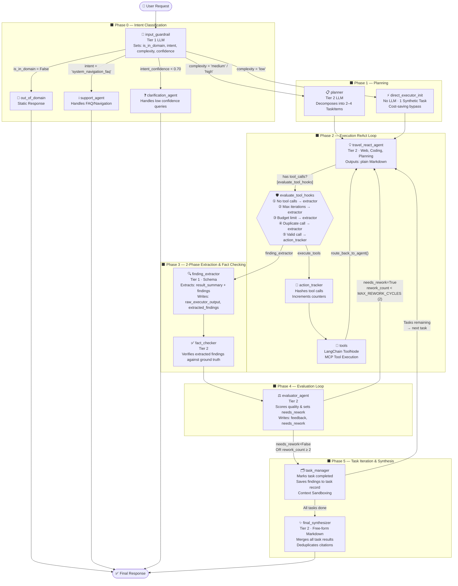

# Cognitive Agent Engine — Current Graph Architecture

> **Version:** Post-Refactor (2-Phase Pipeline & Guardrail)
> **Providers:** OpenAI · Anthropic (Claude)
> **Orchestration:** LangGraph `StateGraph`

---

## 1. Core Design Principles

The system operates as a **directed acyclic graph** (with intentional cycles for tool loops and rework loops). Three key architectural decisions shape the entire design:

1. **2-Phase Content/Extraction Separation** — Executor nodes output free-form Markdown. A dedicated `finding_extractor` node applies a structured LLM call downstream to safely parse findings into typed Pydantic schemas.
2. **Complexity-Aware Routing** — Simple requests bypass the Planner entirely (cost savings). Complex, multi-step requests are decomposed into a sequential task queue.
3. **Programmatic Safeguards** — Every potential infinite loop in the graph is bounded by hard constants enforced in the conditional edge functions, not in the LLM prompts.

---

## 2. AgentState — Shared Memory

All nodes communicate exclusively through `AgentState`, a `TypedDict` that LangGraph hydrates and persists across the graph.

| Field | Type | Set By | Read By |
|---|---|---|---|
| `messages` | `Sequence[BaseMessage]` | All nodes | All nodes |
| `user_id` / `session_id` | `str` | API entry | Executor nodes |
| `is_in_domain` | `bool` | `input_guardrail` | `route_from_guardrail` |
| `intent_category` | `str` | `input_guardrail` | `route_from_guardrail` |
| `intent_confidence` | `float` | `input_guardrail` | `route_from_guardrail` |
| `ambiguity_reason` | `str` | `input_guardrail` | `clarification_agent` |
| `complexity` | `str` | `input_guardrail` | `route_from_guardrail` |
| `objective` | `str` | `input_guardrail` | `planner`, `evaluator_agent` |
| `detected_language` | `str` | `input_guardrail` | Various |
| `tasks` | `List[Dict]` | `planner` / `direct_executor_init` | `task_manager`, Executors |
| `current_task_id` | `int` | `planner` / `task_manager` | `task_manager`, Executors |
| `iteration_count` | `int` | `planner` → Executors | `evaluate_tool_hooks` |
| `tool_call_count` | `int` | `action_tracker` | `evaluate_tool_hooks` |
| `action_history` | `List[str]` | `action_tracker` | `evaluate_tool_hooks` |
| `rework_count` | `int` | `evaluator_agent` | `route_from_evaluator` |
| `evaluator_feedback` | `str` | `evaluator_agent` | `travel_react_agent` |
| `evaluator_notes` | `str` | `evaluator_agent` | `task_manager` |
| `needs_rework` | `bool` | `evaluator_agent` | `route_from_evaluator` |
| `raw_executor_output` | `str` | `finding_extractor` | `fact_checker`, `evaluator_agent`, `task_manager` |
| `extracted_findings` | `List[Dict]` | `finding_extractor` | `fact_checker`, `evaluator_agent`, `task_manager` |
| `fact_check_result` | `Dict` | `fact_checker` | `evaluator_agent` |

---

## 3. Node Reference

### Phase 0 — Entry & Intent Classification

#### `input_guardrail`
- **LLM Tier:** Tier 1 (fast)
- **Writes to State:** `is_in_domain`, `intent_category`, `complexity`, `objective`, `detected_language`
- **Description:** The graph entry point. Reads the latest user message and outputs a structured routing decision. Checks if the query is in-domain, identifies the intent (e.g., `system_navigation_faq`), and assesses task complexity.

#### `out_of_domain`
- **LLM Tier:** None (static response)
- **Description:** Returns a standard message for out-of-domain queries and ends the workflow.

#### `support_agent`
- **LLM Tier:** Tier 2 (balanced)
- **Description:** Handles basic system navigation and FAQ queries without entering the complex planning and execution pipeline.

#### `clarification_agent`
- **LLM Tier:** Tier 1 (fast)
- **Activated When:** `intent_confidence` < 0.70
- **Description:** Asks the user clarifying questions when their prompt is ambiguous or lacks enough detail to confidently route to a specific intent. Ends the workflow.

---

### Phase 1 — Planning

#### `planner`
- **LLM Tier:** Tier 2 (balanced)
- **Activated When:** `complexity` is `'medium'` or `'high'`
- **Writes to State:** `tasks`, `current_task_id`, `iteration_count` = 0, `rework_count` = 0
- **Description:** Acts as a project manager. Decomposes the user's objective into 2–4 sequential task sub-tasks, each with its own description. Routes directly to the `travel_react_agent`.

#### `direct_executor_init`
- **LLM Tier:** None (pure logic node)
- **Activated When:** `complexity` is `'low'`
- **Writes to State:** `tasks` (1 synthetic task), `current_task_id` = 1, all counters reset
- **Description:** A cost-saving bypass. Skips the Planner entirely and wraps the user's raw prompt into a single task object. Routes directly to the `travel_react_agent`.

---

### Phase 2 — Execution (ReAct Loop)

#### `travel_react_agent`
- **LLM Tier:** Tier 2 (balanced)
- **Domain:** General-purpose — web searches, itineraries, coding, weather, standard Q&A
- **Tools:** Full MCP tool suite
- **Description:** Follows the **Reason → Action → Observation → Evaluate** cycle. Produces **free-form Markdown output**. It never requests JSON formatting — that responsibility belongs entirely to `finding_extractor`.

#### `action_tracker`
- **LLM Tier:** None (pure logic node)
- **Description:** An interceptor that sits between the Executor and the actual tool node. Before any tool runs, it hashes the `(tool_name, args)` pair and appends it to `action_history`, and increments `tool_call_count`. Enables the duplicate detection and budget limit safeguards in `evaluate_tool_hooks`.

#### `tools` *(LangChain ToolNode)*
- **Description:** The standard LangChain `ToolNode` wrapping all registered MCP tools. Executes the tool call and appends a `ToolMessage` to the message stream.

---

### Phase 3 — 2-Phase Information Extraction

#### `finding_extractor`
- **LLM Tier:** Tier 1 (fast)
- **Writes to State:** `raw_executor_output`, `extracted_findings`
- **Description:** Receives the executor's raw Markdown, then applies a short, tightly-scoped structured-output LLM call to extract structured findings. **This is the only place where JSON is produced from executor content.** By isolating JSON extraction here, the risk of `JSONDecodeError` from code snippets or Markdown headers embedded in executor responses is eliminated entirely.

#### `fact_checker`
- **LLM Tier:** Tier 2 (balanced)
- **Writes to State:** `fact_check_result`
- **Description:** Verifies the extracted findings against available tools or logical consistency before evaluation. Ensures the agent doesn't hallucinate facts.

---

### Phase 4 — Evaluation & Rework

#### `evaluator_agent`
- **LLM Tier:** Tier 2 (balanced)
- **Reads from State:** `raw_executor_output`, `extracted_findings`, `objective`, `action_history`, `rework_count`
- **Writes to State:** `evaluator_feedback`, `needs_rework`, `rework_count` (incremented if reworking)
- **Description:** Audits the extraction results against the master objective. Combines critique and reflection into a single node. Evaluates tool quality, evidence, and citations, and makes a binary decision (`needs_rework`). When `needs_rework=True` and the rework counter is below `MAX_REWORK_CYCLES=2`, routes back to `travel_react_agent`. If the cap is reached, force-advances to `task_manager`.

---

### Phase 5 — Task Iteration & Final Output

#### `task_manager`
- **LLM Tier:** None (pure logic node)
- **Reads from State:** `raw_executor_output`, `extracted_findings`, `tasks`, `current_task_id`
- **Writes to State:** `tasks` (marks current as `completed`), advances `current_task_id`
- **Description:** The iteration controller. Saves `raw_executor_output` and `extracted_findings` directly into the current task's record (zero JSON parsing — data comes pre-structured from `finding_extractor`). If more tasks are pending, performs **Context Sandboxing** (removes all messages except the first user prompt) and queues the next task. If the queue is empty, routes to `final_synthesizer`.

#### `final_synthesizer`
- **LLM Tier:** Tier 2 (balanced)
- **Writes to State:** `messages` (final response)
- **Description:** Reads all completed task results and aggregated findings, then generates a single, polished, deduplicated Markdown response for the user. Also records the total `iteration_count` as a Prometheus metric.

---

## 4. Full Graph Diagram



---

## 5. Conditional Edge Router Reference

| Router Function | Source Node | Conditions | Targets |
|---|---|---|---|
| `route_from_guardrail` | `input_guardrail` | `is_in_domain == False` | `out_of_domain` |
| | | `intent_confidence < 0.70` | `clarification_agent` |
| | | `intent_category == 'system_navigation_faq'` | `support_agent` |
| | | `complexity == 'low'` | `direct_executor_init` |
| | | Default / `complexity == 'medium' / 'high'` | `planner` |
| `evaluate_tool_hooks` | `travel_react_agent` | No tool calls | `finding_extractor` |
| | | `iteration_count >= 8` | `finding_extractor` (forced) |
| | | `tool_call_count >= 10` | `finding_extractor` (forced) |
| | | Duplicate action detected | `finding_extractor` (forced) |
| | | Valid tool call | `action_tracker` |
| `route_from_evaluator` | `evaluator_agent` | `needs_rework=True` AND `rework_count < 2` | `travel_react_agent` (rework) |
| | | `needs_rework=False` OR `rework_count ≥ 2` | `task_manager` |
| `route_from_task_manager` | `task_manager` | `current_task_id is not None` | `travel_react_agent` (next task) |
| | | `current_task_id is None` | `final_synthesizer` |

---

## 6. Programmatic Safeguards

All safeguards are enforced in `evaluate_tool_hooks` and `route_from_evaluator` — outside of LLM prompts, making them reliable and deterministic.

| Safeguard | Constant | Enforced In | Action |
|---|---|---|---|
| Max Iterations | `MAX_ITERATIONS = 8` | `evaluate_tool_hooks` | Force-route to `finding_extractor` |
| Max Tool Calls (Budget) | `MAX_TOOL_CALLS = 10` | `evaluate_tool_hooks` | Force-route to `finding_extractor` |
| Duplicate Tool Detection | MD5 hash comparison | `evaluate_tool_hooks` | Block + force-route to `finding_extractor` |
| Max Rework Cycles | `MAX_REWORK_CYCLES = 2` | `route_from_evaluator` | Skip rework, force-advance to `task_manager` |

---

## 7. LLM Tier Assignment

| Tier | Usage | OpenAI Model | Claude Model |
|---|---|---|---|
| Tier 2 (Balanced) | `planner`, `travel_react_agent`, `fact_checker`, `evaluator_agent`, `support_agent`, `final_synthesizer` | `tier2_balanced_model` | `tier2_balanced_model` |
| Tier 1 (Fast) | `input_guardrail`, `clarification_agent`, `finding_extractor` | `tier1_fast_model` | `tier1_fast_model` |

> Tier assignments are resolved from `settings.py` — never hardcoded in node logic. Changing a model in `.env` automatically propagates to all nodes using that tier.

---

## 8. Infrastructure Components (Container)

The `Container` class bootstraps all shared infrastructure services on first request.

```
Container
├── redis_client          → Async Redis (session management)
├── embedding_provider    → OpenAIEmbeddings (text-embedding-3-small)
├── vector_store          → QdrantVectorStore
├── memory_store          → QdrantMemoryStore (long-term memory writes)
├── semantic_cache        → QdrantSemanticCache (versioned by LLM model tag)
├── memory_service        → MemoryService (CRUD over memory_store)
├── extractor             → FactExtractor (background fact mining, OpenAI or Claude)
├── memory_worker         → MemoryWorker (RabbitMQ consumer pipeline)
└── hybrid_search         → HybridRetriever (BM25 + dense vector retrieval)
```
